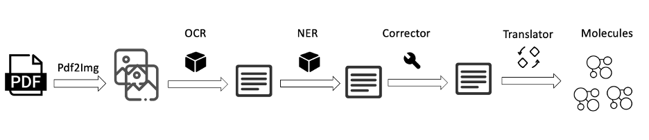
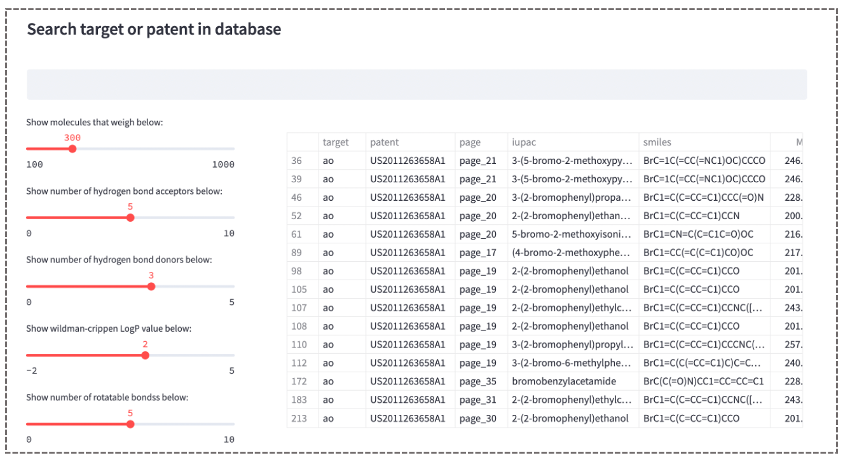

## Official implementation for ChemDT and ChemDTD

### ChemDT

<figure>
  
  <figcaption>The overall extraction workflow for ChemDT"</figcaption>
</figure>


#### Run ChemDT to extact IUPACs in PDF

1. pull docker image

```
docker push registry.cn-beijing.aliyuncs.com/hilab_space/chemdt:v1
```

```
docker pull registry.cn-beijing.aliyuncs.com/hilab_space/pdf_process:v1
```

2. start the docker service

```
docker run --rm -e is_debug=N -e dev_or_pro=dev -p 5533:5533 chemdt:v1
```

```
docker run --rm -p 3114:3080 pdf_process:v1
```

3. Install envirnment

```
conda env create -f environment.yaml
conda activate chemdt
```

4. run main function

```python
cd tools
python client.py
```

#### APIs for extaction piplines

1. Convert PDF fild to images.

```python
client = ChemDTClient()
pages = client.pdf2img("path_of_pdf"，"save_dir")
```

2. IUPAC detection.

```python
client = ChemDTClient()
iupac_det_res = client.iupac_det(origin_img_path)["iupac_result"]
```


3. OCR

```python
client = ChemDTClient()
box, txt = client.iupac_ocr("path_of_image")
```


4. Iupac fixer

```python
client = ChemDTClient()
client.iupac_fixer("iupac_text")
```

5. Full pipline

```python
client = ChemDTClient()
pdf_path = '../test_data/p2.pdf'
save_dir = '../pdf_images'
client.run_pipline(pdf_path, save_dir = save_dir)
```


### ChemDTD 

<figure>
  
  <figcaption>The front end of ChemDTD</figcaption>
</figure>

<figure>
  
  <figcaption>The front end of ChemDTD</figcaption>
</figure>

#### Run webserver for ChemDTD for visualizing your local database


1. Write extracting data to the local database. You need modify the configuration in `conf.yaml`
```
python to_db.py
```

1. Start webserver and wait a moment to let the front-end to load all your data. 
```sh
streamlit run app.py --server.addres 0.0.0.0 --server.port 5001
```
2. View your app in your browser with port 5001

